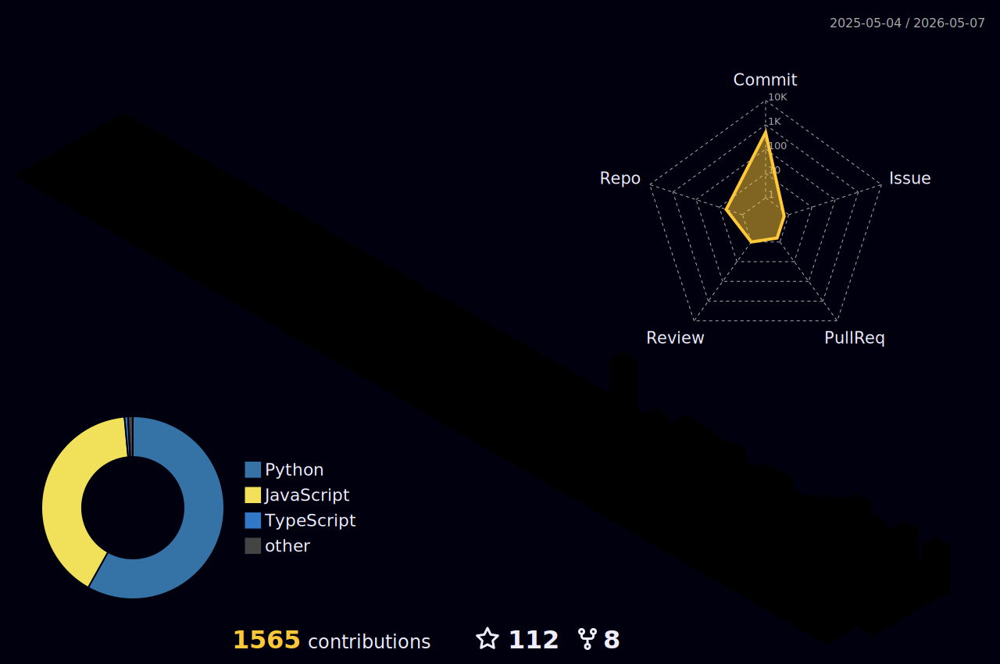

<div align="center">

<!-- Animated Header -->


<!-- Profile Visits -->


</div>

---

## 🧑‍💻 About Me


```json
{
  "name": "Aritro Saha",
  "role": "Associate Software Developer",
  "company": "Bristol Myers Squibb",
  "stack": ["Python", "AWS", "Databricks", "GenAI"],
  "currently_learning": "Databricks",
  "hobbies": ["Beatboxing", "Football"],
  "reach_me_at": "aritrosaha2025@gmail.com"
}
```

<br clear="right"/>

---

## 🌐 Connect With Me

<p align="left">
  <a href="https://www.linkedin.com/in/aritro-saha-77562a222/" target="_blank">
    
  </a>&nbsp;
  <a href="https://twitter.com/halcyon_past" target="_blank">
    
  </a>&nbsp;
  <a href="https://instagram.com/halcyon_past" target="_blank">
    
  </a>&nbsp;
  <a href="https://codepen.io/halcyon_past" target="_blank">
    
  </a>&nbsp;
  <a href="https://www.youtube.com/@veripyed" target="_blank">
    
  </a>
</p>

---

## 🛠️ Languages & Tools

### ⚙️ Backend & Data


### 🎨 Frontend


### 🗄️ Databases & Cloud


### 🔧 Tools & OS


---

## 📺 Latest YouTube Videos

<a href="https://www.youtube.com/@veripyed?sub_confirmation=1">
  
</a>

<br/><br/>

<table>
<thead> <tr> <th>Thumbnail</th> <th>Video Link</th> <th>Date Posted</th> </tr> </thead>
<!-- BLOG-POST-LIST:START -->
 <tbody> <tr> <td><a href="https://www.youtube.com/watch?v=r34w3YrkAA8"></a></td> <td><a href="https://www.youtube.com/watch?v=r34w3YrkAA8">Bajaj Finserv Interview Experience 2025 | Data Science Intern | Off Campus</a></td> <td>Mar 30, 2025</td> </tr> </tbody> 

 <tbody> <tr> <td><a href="https://www.youtube.com/watch?v=U8fzDvvqef8"></a></td> <td><a href="https://www.youtube.com/watch?v=U8fzDvvqef8">Error Handling in Python from BASIC to ADVANCED</a></td> <td>Jan 19, 2025</td> </tr> </tbody> 

 <tbody> <tr> <td><a href="https://www.youtube.com/watch?v=M1zjnwxTGl4"></a></td> <td><a href="https://www.youtube.com/watch?v=M1zjnwxTGl4">GET HIGH ON CODE</a></td> <td>Jan 17, 2025</td> </tr> </tbody> 

 <tbody> <tr> <td><a href="https://www.youtube.com/watch?v=2LGYpzOgELM"></a></td> <td><a href="https://www.youtube.com/watch?v=2LGYpzOgELM">LEARN OOPS in 3 Minutes</a></td> <td>Dec 21, 2024</td> </tr> </tbody> 

 <tbody> <tr> <td><a href="https://www.youtube.com/watch?v=2u19wN1tDT4"></a></td> <td><a href="https://www.youtube.com/watch?v=2u19wN1tDT4">APIs Explained in Under 2 Minutes</a></td> <td>Dec 16, 2024</td> </tr> </tbody> 
<!-- BLOG-POST-LIST:END -->
</table>

---

## 🏅 Badges & Achievements

### 🪶 Holopin Badges
[](https://holopin.io/@halcyonpast)

### 🌸 GSSoC '24 Badges
<div align="center">
  <a href="https://gssoc.girlscript.tech/leaderboard">
    
    
    
    
    
    
    
    
  </a>
</div>

---

## 📊 Stats & Activity

### 🧩 LeetCode
<div align="center">
  
</div>

### 🔥 GitHub Streak
<div align="center">
  
</div>

### 🌌 3D Contribution Graph
<div align="center">
  
</div>

### 🐍 Contribution Snake
<div align="center">
  
</div>

---

<div align="center">
  
</div>
