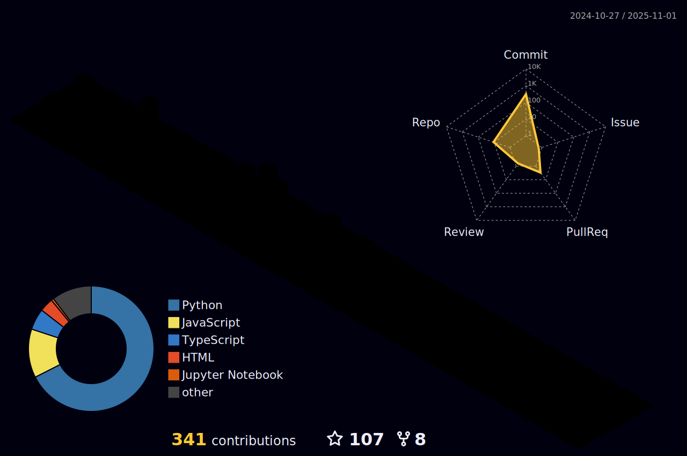

[](https://github.com/Akshay090/svg-banners)


<p align="center">
<a href="https://git.io/typing-svg">
</p>
  

  
<h3 align="center">🧿There is always one more bug to fix!!🧿</h3>
<p align="center">  </p>


```yaml
Name: Aritro Saha
Occupation: Student
Stream: Electronics and Computer Engineering
University: Vellore Institute of Technology, Chennai
Interests: Python, Arduino, ML, WebDev
Currently-Learning: GenAI
Other-Hobbies: Beatboxing, Football
Reach-me-at: aritrosaha2025@gmail.com
```

<h2 align="left">🧑🏻‍💻 &nbsp; Connect with me </h2>

<p align="left">
  <a href="https://www.linkedin.com/in/aritro-saha-77562a222/" target="blank"></a>
  <a href="https://twitter.com/halcyon_past" target="blank"></a>
  <a href="https://instagram.com/halcyon_past" target="blank"></a>
  <a href="https://codepen.io/halcyon_past" target="blank"></a>
</p>

<h2 align="left">⛱️ &nbsp; Holopin Badges </h2>

[](https://holopin.io/@halcyonpast)

## ⛱️ GSSOC(24) Badges 🪶
<div style='display:flex; align-items:center; gap: 10px;' align='center'><a href="https://gssoc.girlscript.tech/leaderboard">
  
  
  
  
  
  
  
  </a>
</div>

### 📺 Latest YouTube Videos 🎥

<div align="center">

[](https://www.youtube.com/@veripyed?sub_confirmation=1)

</div>

<!-- BLOG-POST-LIST:START --><table><tr><td><a href="https://www.youtube.com/watch?v=oAA0IglYapM"></a></td>
<td><a href="https://www.youtube.com/watch?v=oAA0IglYapM">Realtime Data Sync Between Google Sheets and MySQL || @superjoinai  || Recruitment Task</a><br/>Sep 27, 2024</td></tr></table>
<table><tr><td><a href="https://www.youtube.com/watch?v=LE_ZhMGaN8A"></a></td>
<td><a href="https://www.youtube.com/watch?v=LE_ZhMGaN8A">|PANDA BEATBOX| I did this cuz i was hella bored #beatbox #shorts #reels #music #comedy #tiktok</a><br/>May 4, 2021</td></tr></table>
<table><tr><td><a href="https://www.youtube.com/watch?v=mcAQiCTXQSU"></a></td>
<td><a href="https://www.youtube.com/watch?v=mcAQiCTXQSU">Titans Superior Live Stream</a><br/>Mar 12, 2019</td></tr></table>
<table><tr><td><a href="https://www.youtube.com/watch?v=bBA_arV-PEA"></a></td>
<td><a href="https://www.youtube.com/watch?v=bBA_arV-PEA">Trailer 2 // Titans Superior</a><br/>Dec 17, 2017</td></tr></table>
<table><tr><td><a href="https://www.youtube.com/watch?v=WwJoxp4t0n8"></a></td>
<td><a href="https://www.youtube.com/watch?v=WwJoxp4t0n8">What is Alexa??? // 2min introduction //Titans Superior</a><br/>Nov 28, 2017</td></tr></table>
<!-- BLOG-POST-LIST:END -->

<h2 align="left">📚 &nbsp; Languages and Tools </h2>


<h2> 📈 &nbsp;LeetCode Stats! </h2>


<h2>   &nbsp;My GitHub History! 📈</h2>



[](https://quira.sh?utm_source=widgets&utm_campaign=halcyon-past)
[](https://quira.sh?utm_source=widgets&utm_campaign=halcyon-past)


<p align="left">
  
</p>
